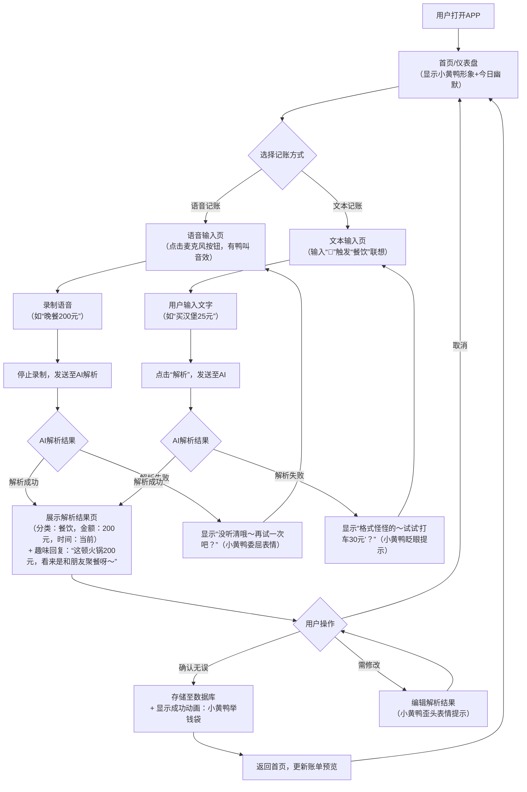

# 小黄鸭AI记账APP MVP开发阶段完整方案

### 一、用户故事地图

围绕核心需求 “便捷记账 + 基础查询”，并新增 “趣味互动” 相关内容，梳理用户故事如下：

1.  **语音记账场景**

*   作为用户，我可以通过语音输入消费信息（如 “早餐花了 15 元”），APP 能自动识别金额、分类（如 “餐饮”）和备注，这样我不用手动输入，记账更高效。

*   作为用户，当语音识别错误时（如把 “15 元” 识别成 “50 元”），我可以手动修改信息，确保记录准确。

*   作为用户，我在语音记账后，能收到 AI 的趣味回复（如 “早餐要吃好，今天元气满满！”），让记账不枯燥。

1.  **文本记账场景**

*   作为用户，我可以手动输入文字描述（如 “打车到公司 23 元”），APP 能解析出关键信息并记录，满足我不方便语音输入的场景（如会议中）。

*   作为用户，我可以直接输入结构化信息（如金额 + 分类 “30 元 奶茶”），APP 快速识别并存储，提升输入效率。

*   作为用户，在文本记账时，输入框支持 “表情互动”（如输入 “🍜” 自动联想 “餐饮” 分类，并回复 “嗦粉快乐！”），增加输入乐趣。

1.  **账单查询场景**

*   作为用户，我可以查看今日 / 本月的总支出，快速了解消费概况。

*   作为用户，我可以按时间顺序查看所有账单列表，方便追溯每笔消费。

*   作为用户，我可以查看某笔账单的详情（如具体时间、分类、备注），确认记录是否准确。

*   作为用户，在分类统计页能看到 “吐槽式总结”（如 “交通支出占比 30%，看来你是通勤小达人～”），让查询过程更有趣。

1.  **基础管理场景**

*   作为用户，我可以修改已记录的账单信息（如分类错了改 “餐饮” 为 “零食”），避免错误数据留存。

*   作为用户，我可以删除误记的账单，保持账单整洁。

*   作为用户，当我删除账单时，AI 会俏皮追问（“确定要删掉这笔‘小秘密’吗？”），减少操作严肃感。

1.  **个性化反馈场景**

*   作为用户，当我连续 3 天在同一分类消费（如每天买咖啡），AI 会调侃式提醒（“咖啡重度爱好者认证！本周已为咖啡事业贡献 150 元”），增加互动感。

*   作为用户，当我输入大额消费（如 “买鞋花了 1000 元”），AI 会用轻松语气回应（“今天是精致生活代言人呀～”），避免负面评价。

### 二、MVP 功能清单（优先级排序）

| 优先级             | 功能模块      | 具体功能点                                                   | 说明                                                         |
| ------------------ | ------------- | ------------------------------------------------------------ | ------------------------------------------------------------ |
| **P0（必须实现）** | 语音记账      | - 语音输入入口（首页快捷按钮，图标为 “戴麦克风的小黄鸭”）- AI 解析（金额、分类、时间默认当前）- 解析结果确认页（可修改，小黄鸭歪头表情提示）- 确认后自动存储，显示成功动画：小黄鸭举钱袋- 错误提示（如未识别到金额，显示 “没听清哦～再试一次吧？” 并配小黄鸭委屈表情）- AI 解析后增加 “场景化回复”（如识别 “早餐 10 元”→“早餐要吃好，今天元气满满！”）- 麦克风按钮点击时有 “小黄鸭叫” 音效（可关闭） | 核心功能，MVP 的核心竞争力，需保证基础识别准确率，同时通过趣味反馈强化核心功能记忆点，音效可选避免干扰 |
| **P1（重要功能）** | 文本记账      | - 文本输入框（支持自然语言如 “买衣服花了 300 元”，图标为 “举键盘的小黄鸭”）- AI 解析（同语音逻辑）- 解析结果确认页（可修改）- 确认后自动存储- 输入框支持 “表情互动”（如输入 “🍔” 自动联想 “餐饮” 分类，并回复 “嗦粉快乐！”）- 解析成功后显示动态小动画（如钱袋跳一下） | 补充语音场景（如安静环境），解析逻辑可复用语音模块的 AI 能力，文本场景也保持趣味性，动画轻量化不影响性能 |
| **P2（辅助功能）** | 基础查询      | - 账单总览（今日 / 本月支出）- 账单列表（按时间倒序，每条左侧加卡通化分类小图标）- 分类统计（基础分类如餐饮、交通）- 分类统计页增加 “吐槽式总结”（如 “交通支出占比 30%，看来你是通勤小达人～”）- 账单列表滑动时随机出现 “小黄鸭小贴士”（如 “记账 3 天，奖励自己一杯奶茶吧！”） | 满足用户 “记完能查看” 的基本需求，数据可视化以文字为主，让查询过程更有趣，小贴士控制频率（每天 1-2 条） |
| **P2（辅助功能）** | 账单管理      | - 单条账单详情查看- 账单修改（金额、分类、备注）- 账单删除，删除时 AI 俏皮追问（“确定要删掉这笔‘小秘密’吗？”） | 解决记录错误时的修正需求，保证数据准确性，减少操作严肃感     |
| **P2（辅助功能）** | 首页 / 仪表盘 | - 快捷记账入口（语音 / 文本按钮）- 今日支出概览- 最近 3 条账单预览- 左下角常驻 “小黄鸭虚拟形象”（2cm×2cm 动态图标，记账成功后跳一下，闲置时打哈欠）- 顶部标题下方加 “每日幽默条”（滚动文字，如 “记账的意义：知道钱去哪了，然后假装不在乎”） | 作为用户进入 APP 的首屏，聚焦核心操作，减少跳转，强化 “小黄鸭” IP 形象，幽默内容轻量化（不占核心操作区） |

### 三、交互流程图（核心流程）

### 四、低保真原型设计说明（核心界面）

#### 1. 首页 / 仪表盘（核心入口，趣味化升级）

*   **布局**：

    *   顶部：显示 “小黄鸭记账” 标题 +“每日幽默条”（滚动文字，如 “记账的意义：知道钱去哪了，然后假装不在乎”）+ 本月支出概览（如 “本月支出：¥1,250”）。
    
    *   中部：两大快捷按钮（占屏 40%），左侧 “语音记账”（戴麦克风的小黄鸭图标 + 文字），右侧 “文本记账”（举键盘的小黄鸭图标 + 文字）。
    
    *   底部：最近 3 条账单预览（每条显示时间、卡通化分类图标、金额，如 “10:30 餐饮（汉堡图标） ¥15”）+“查看全部” 按钮。
    
    *   左下角：常驻 “小黄鸭虚拟形象”（2cm×2cm 动态图标，记账成功后跳一下，闲置时打哈欠）。

#### 2. 语音记账 - 解析确认页（趣味反馈强化）

*   **布局**：

    *   顶部：返回按钮 +“确认账单” 标题。
    
    *   中部：解析结果卡片（占屏 50%），包含：

        *   分类：自动识别（如 “餐饮”，可点击修改下拉框）。
    
        *   金额：自动识别（如 “¥15.00”，可点击输入框修改）。
    
        *   时间：默认当前时间（可点击修改）。
    
        *   备注：自动提取（如 “早餐”，可手动补充）。
    
    *   解析结果卡片下方：增加 “趣味回复区”（浅色背景，小黄鸭头像 + 气泡文字，如 “这顿火锅 200 元，看来是和朋友聚餐呀～”）。
    
    *   底部：两个按钮（左 “取消” 为小黄鸭摇头图标，右 “确认” 为小黄鸭点头图标，替代纯文字按钮）。

#### 3. 文本记账 - 输入 & 确认页

*   **输入页**：

    *   顶部：返回按钮 +“文本记账” 标题。
    
    *   中部：大尺寸输入框（提示文字：“输入消费信息，如‘打车 23 元’，支持表情哦～”）。
    
    *   底部：“解析” 按钮（点击后跳转至确认页）。

*   **确认页**：与语音记账确认页一致（复用布局）。

#### 4. 账单列表页（轻松氛围营造）

*   **布局**：

    *   顶部：返回按钮 +“全部账单” 标题 + 筛选下拉框（今日 / 本周 / 本月）。
    
    *   中部：账单列表（按时间倒序），每条账单包含：

        *   左侧：时间（如 “08-04 09:30”）+ 卡通化分类图标（如餐饮是汉堡，交通是汽车）+ 分类名称。
    
        *   右侧：金额（如 “¥15”）。
    
    *   滑动到页面底部时，随机出现 “小黄鸭小贴士” 弹框（如 “累计记账 7 天，解锁‘省钱小能手’称号！”），3 秒后自动消失。

#### 5. 账单详情页

*   **布局**：

    *   顶部：返回按钮 +“账单详情” 标题。
    
    *   中部：详细信息（分类、金额、时间、备注，每项单独一行）。
    
    *   底部：两个按钮（左 “删除”，右 “修改”，修改后跳转至确认页）。

通过这份完整方案，既保留了原方案中保障记账核心功能高效实现的内容，又融入了优化方案中的趣味性元素，在不影响核心功能效率的前提下，用 “小黄鸭 IP + 场景化幽默” 提升产品竞争力，让用户从 “被动记账” 变成 “主动想互动”，适合提交给项目经理用于 MVP 开发阶段的指导。

> （注：文档部分内容可能由 AI 生成）